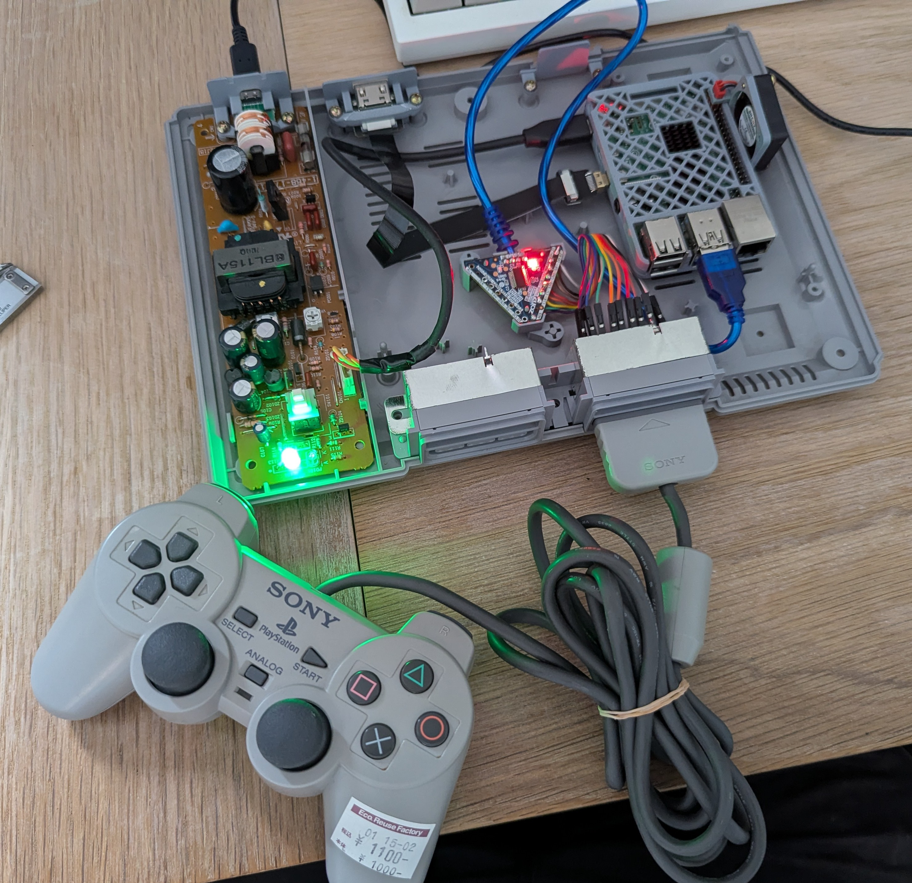
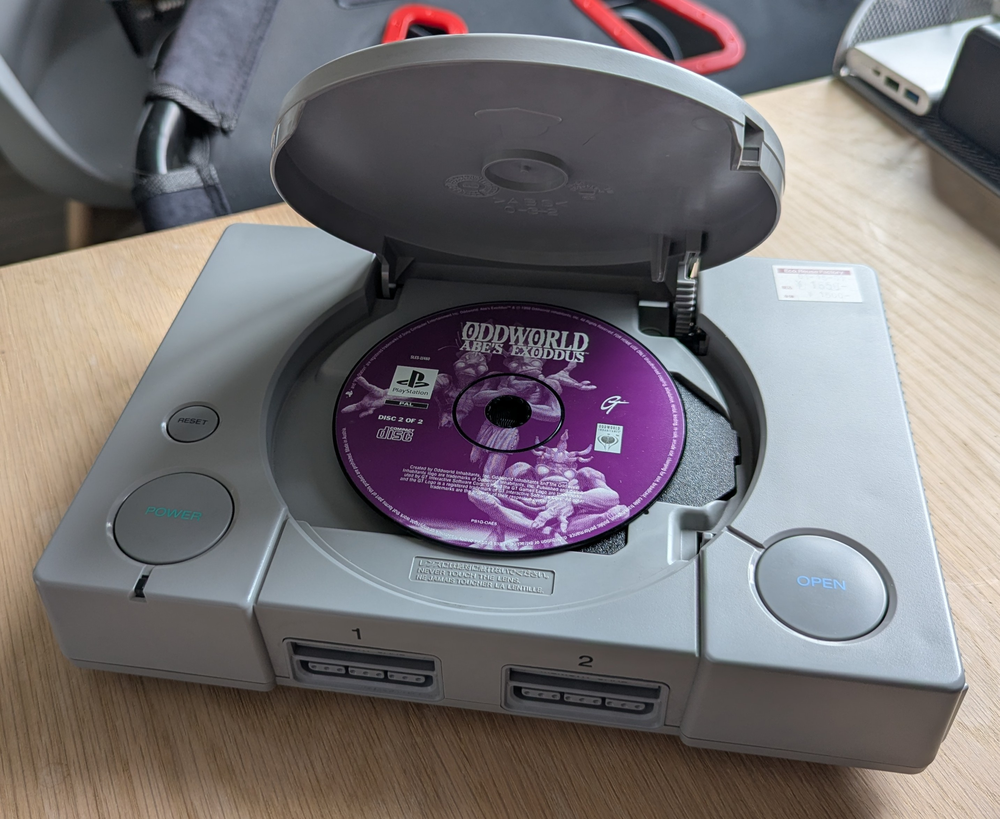
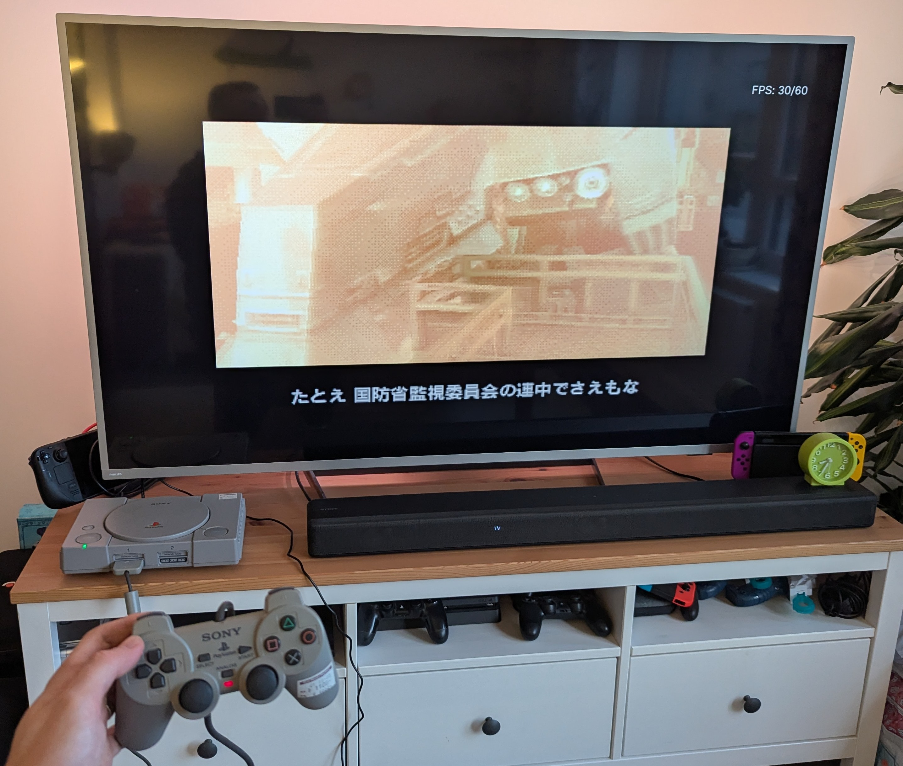

WIP Based on the project by [Anwilc](https://anwilc.com/2019/12/06/PSX_Retropie.html) with some additions to modernise the I/O whilst retaining some of the core tactile features of the original case. 

Original system is a "for parts" console found in a second hand store in Japan [despite the controller just working straight away!]. No permanent modifications to the plastic chassis are required and all components are mounted using existing mounting points.

Software is based on [NESPI](https://www.daftmike.com/2016/07/NESPi.html) with modifications to suit the original PS1 functionality.

All custom code and CAD for 3D printed parts will be published once I get around to tidying all the bits up.

*Controller test*

*External view of finished system.*

*Playing Metal Gear Solid for the first time.*
